<a href="https://github.com/uni-helper/unplugin-uni-sfc/stargazers"></a>
<a href="https://www.npmjs.com/package/@uni-helper/unplugin-uni-sfc"></a>
<a href="https://www.npmjs.com/package/@uni-helper/unplugin-uni-sfc"></a>
<br/>

把使用 TypeScript / Less 的 [uni-app](https://uniapp.dcloud.net.cn/) SFC（`.vue` / `.nvue`）在构建阶段降级为 JavaScript / CSS。

打包阶段把 `lang="ts"` 的 script 块与模板表达式中的 TS 语法擦除成 JS，把 `lang="less"` 的 style 块编译成 CSS，产物中的 `.vue` 以降级后的源码直接输出。依赖解析、编译和产物组织仍然交给打包工具（vite / rolldown / tsdown），插件不重复造轮子。

## 特性

- 🧹 **语言降级**：`lang="ts"` / `lang="tsx"` 的 script 与模板表达式降级为 JS，产物 `.vue` 不再依赖 TS
- 🏷 **类型宏回填**：`defineProps<T>()` / `defineEmits<T>()` / `withDefaults` 用 Vue 官方编译器生成运行时声明，跨文件类型与 tsconfig `paths` 都能解析
- 🎨 **样式降级**：`<style lang="less">` 编译为 CSS，变量、嵌套、`@import` 全部内联
- 🔀 **条件编译透传**：`#ifdef` / `#ifndef` / `#if` / `#else` / `#endif` 逐字节保留给下游，同时保证产物在每个平台下都是正确的 JS / CSS
- 🔗 **交给打包工具**：`.vue` 被当成普通 JS 模块参与依赖图，引用与产物路径由打包工具决定
- 🧩 **零配置**：ESM 产物下自动打开 `preserveModules`，没有可配置项
- 🛑 **失败即中断**：类型解析失败、less 编译失败、条件编译写法不安全时直接报错，不静默产出坏组件

## 安装

环境要求：Node.js ≥ 20.19（或 ≥ 22.12）。

```sh
pnpm add -D @uni-helper/unplugin-uni-sfc
```

## 使用

**vite.config.ts**

```ts
import UnpluginUniSfc from '@uni-helper/unplugin-uni-sfc/vite'

export default defineConfig({
  plugins: [UnpluginUniSfc()],
})
```

插件只接管构建产物；dev server 下的 `.vue` 仍交给其它插件（如 `@vitejs/plugin-vue`）处理。

**tsdown.config.ts / rolldown 配置**

```ts
import UnpluginUniSfc from '@uni-helper/unplugin-uni-sfc/rolldown'

export default defineConfig({
  plugins: [UnpluginUniSfc()],
})
```

## 给 AI 编码助手：Agent Skill

仓库里带了一份 [Agent Skill](https://agentskills.io)，位于 [`skills/unplugin-uni-sfc/SKILL.md`](./skills/unplugin-uni-sfc/SKILL.md)。它把本插件的安装、配置、硬性约束和报错速查整理成一份**按需加载**的说明书：AI 编码助手在帮你配构建、排插件报错时自己读它，不必把整篇 README 塞进上下文。

用 [`skills` CLI](https://skills.sh) 安装：

```sh
# 安装到当前项目（默认装到 ./<agent>/skills/，可随项目提交、与团队共享）
npx skills add uni-helper/unplugin-uni-sfc
```

## 类型宏：defineProps / defineEmits

`defineProps<T>()` / `defineEmits<T>()` 以及 `withDefaults` 的运行时声明只存在于类型里，类型擦除后会丢失，插件会用 Vue 官方编译器（`extractRuntimeProps` / `extractRuntimeEmits`）把它们生成出来，回填到原宏调用处：

- 跨文件导入的类型（`import type { Props } from './props'`）会被解析——包括 `Pick`、`Omit`、`extends` 等；
- 类型解析需要 `typescript`，插件会从构建目录向上查找；同时支持 tsconfig 的 `paths` 别名（`@/types`），前提是工程里有 `tsconfig.json`；
- `withDefaults` 的默认值会合进 props 声明；若默认值无法静态内联（如展开、函数返回），声明里会用到 Vue 的 `mergeDefaults`，插件会自动补上它的导入；
- 解构写法 `const { count = 1 } = defineProps<T>()` 的默认值同样会保留。

类型解析失败时构建会**中断并报错**，而不是悄悄产出没有 props 声明的组件（那会让 props 退化成普通 attributes，到运行期才暴露）。此时请修正类型引用，或改用运行时声明 `defineProps({ ... })` / `defineEmits([...])`。

## 样式：less 降级为 CSS

`<style lang="less">` 会在构建时用 [less](https://lesscss.org) 编译为 CSS：变量替换、嵌套展开、`@import` 内联（相对 `.vue` 解析），并移除 `lang="less"` 标记，产物中的 `.vue` 不再依赖 less。

- **sass / scss 不需要处理**：uni-app 的编译器自带 sass，`lang="scss"` / `lang="sass"` 原样保留；
- 其它预处理器（stylus 等）不在降级范围内，同样原样保留；
- less 按可选依赖加载：只有 SFC 里出现 `lang="less"` 时才会用到，未安装时构建会报错并提示安装（`pnpm add -D less`）；
- 带 `src` 的外部样式块不处理（与 script 块的规则一致）：它们不会被降级，也不会进入产物，请改为内联样式或自行编译为 CSS。

## 脚本里 import 的样式文件

SFC 脚本里的样式引用（`import './styles/global.less'`）由打包工具的 CSS 管线编译（tsdown 需要 [`@tsdown/css`](https://tsdown.dev/plugins/css)，vite 自带），插件负责处理产物 `.vue` 里对应的引用：

- CSS 管线在渲染阶段已产出对应的 CSS 资产时（vite `cssCodeSplit: true`），引用回填成 CSS 资产的路径，下游构建会正常加载它；
- 资产要到构建收尾才产出时（如 tsdown 的 `@tsdown/css`），整句 `import` 从产物中移除（与打包工具对 JS 导入方的处理一致），并给出告警——编译出的 CSS 仍会作为资产输出，需要时自行引入。

产物中的 `.vue` 不会引用不存在的文件，也不会把 `.less` 引用留给不支持 less 的下游。

## 只支持 ESM 产物

本插件本质是**语言降级**（TS → JS），不改模块语法：产出的 `.vue` 资产本身就是 ESM 源码（`import` / `export`），产物中的 JS 也需要以 ESM 引用这些 `.vue` 文件，因此**只支持 ESM 产物格式**。

- 支持：`esm`（rolldown / tsdown）、`es`（rollup / vite）；未设置 `format` 时打包工具的默认值也是 ESM
- 不支持：`cjs`、`iife`、`umd`、`amd` 等

使用非 ESM 格式时，插件会在构建时警告并保持原样：

- `.vue` 模块不会换回 `.vue` 文件，引用也不会回填，JS 按打包工具的默认行为输出；
- 降级后的 `.vue` 源码仍会作为资产输出，但产物中的 JS 不会引用它们。

## 支持条件编译

插件**不会执行**条件编译：`#ifdef` / `#ifndef` / `#if` / `#else` / `#endif` 指令被**逐字节原样保留**在产物里，由下游 uni-app 按目标平台取舍。

但指令所在的代码仍然会被正确降级——插件会按每个平台的实际投影分别确定「这里该擦掉什么」，因此产物在**任一平台**下都是一份正确的 SFC：

```vue
<script setup lang="ts">
// #ifdef H5
const platform: string = 'h5'
// #endif
// #ifndef H5
const platform: string = 'mp'
// #endif

const config: Record<string, unknown> = {
  deep: true as boolean,
  // #ifdef APP-PLUS
  plus: 1 as number,
  // #endif
}
</script>
```

产物（指令原样、TS 已擦除）：

```vue
<script setup>
// #ifdef H5
const platform = 'h5'
// #endif
// #ifndef H5
const platform = 'mp'
// #endif

const config = {
  deep: true,
  // #ifdef APP-PLUS
  plus: 1,
  // #endif
}
</script>
```

几点说明：

- **注释必须写在注释里**：script 用 `// #ifdef` 或 `/* #ifdef */`，模板用 `<!-- #ifdef -->`，style 只能用 `/* #ifdef */`（less 会吃掉 `//`，写成行注释会报错）；
- **判定条件与 uni-app 一致**：平台名不区分大小写、`-` 与 `_` 等价，支持派生标志（`MP`、`WEB`、`APP-PLUS`、`APP-NVUE`、`VUE3` 等）与 `#if` 表达式（`MP-WEIXIN || H5`、`!H5`）；
- **互斥分支里的同名声明是允许的**（如上面两处 `const platform`）：每个平台的投影里只会剩一处；
- **`.nvue` 使用 nvue 上下文**，`#ifdef APP-NVUE` 能正确判定。

以下几种写法**无法安全处理，会中断构建**（而不是产出静默错误的产物）。这些检查**对 script、template、style 三个块都生效**，且在没有 TS 需要降级的组件上同样会跑：

| 写法 | 原因 |
| --- | --- |
| `#elif` | uni-app 的预处理实现不支持它：条件成立时指令会残留在产物里 |
| 平台名拼写错误（`#ifdef H5-WRONG`） | uni-app 对认不出的名字按「假」处理，代码会凭空消失 |
| 起始关键字大小写写错（`#IfDeF` / `#IFDEF`） | uni-app 只认小写，其它写法会让它内部抛错；而它把异常吞掉后返回原文，整段代码会在**所有平台**生效 |
| 指令不配对（缺 `#endif` / 多余的 `#endif`） | uni-app 的预处理会直接失败 |
| `#ifdef` 落在语句内部（如对象字面量中间）且该处有 TS | 切开的片段自身不是合法语法，无法安全擦除 |
| less 里用 `// #ifdef` | less 会吃掉行注释，指令传不到产物 |
| less 的嵌套规则里写指令 | less 会把规则提到指令外面，样式会在所有平台生效 |

结束关键字的大小写**不受限制**：`#ENDIF` / `#EndIf` / `#Else` 都能正常工作，插件会原样保留，不会改写大小写。

## 产物形态

`.vue` 必须一个模块一个产物才能在生成阶段换回 `.vue` 文件。插件会在 ESM 产物下自动打开 `preserveModules`（对应 tsdown `unbundle: true`），无需手动配置。

`.vue` 在产物中的位置与它的 JS 模块同位（只把扩展名换回 `.vue` / `.nvue`），镜像基准完全由打包工具决定：rolldown / rollup 按 `preserveModules` 的规则推导，tsdown `unbundle` 下对应 `root` 配置。插件不拥有任何产物形态的配置，也没有可配置项——它本质上是做降级处理，产物组织全部交给打包工具。

## 实现原理

1. `load` 阶段读取 `.vue`，用 `@vue/compiler-sfc` 解析后回填类型宏的运行时声明、擦除 TS、把 less 编译成 CSS，得到降级后的 SFC 源码。
2. 同一份降级源码编译出一个 JS 模块视图交给打包工具，脚本和模板里用到的导入因此真实出现在依赖图里——模板中使用的绑定不会被 tree-shaking 丢掉。
3. 生成阶段把 `.vue` 对应的 chunk 换成 `.vue` 资产，位置与它的 JS 模块同位，并把产物 JS 里的引用回填成指向 `.vue`。

### 条件编译为什么能保住指令

直接调用 `oxc-transform` 会「解析 → 变换 → 重新打印」，而打印器会吞掉或搬走字面量、参数列表内部的注释——指令正是注释。所以 TS 擦除改成**只删区间**：

1. 把源码切成「指令行」与「内容区域」；
2. 生成**等长投影**——指令行与当前平台下不生效的区域都替换成同长度空白，投影文本与源码逐偏移对齐，因此可以直接解析出一份「该平台下真实存在的代码」，而指令从不参与解析；
3. 在投影的 AST 上收集该删掉的类型区间，**用回原源码**做纯删除；
4. 少数无法靠删除表达的构造（`enum`、`namespace`、构造器参数属性等）单独交给 oxc 重写——这些区域由指令行分隔，重写碰不到指令。

每一步都有兜底校验：改写前后逐条比对指令、逐个平台校验产物投影仍然是合法且等价的 JS，不满足就中断构建而不是发坏产物。

## License

[MIT](./LICENSE)

## 🙇🏻‍♂️[赞助](https://afdian.com/a/flippedround)

<p align="center">
  <a href="https://afdian.com/a/flippedround">
    
  </a>
</p>
